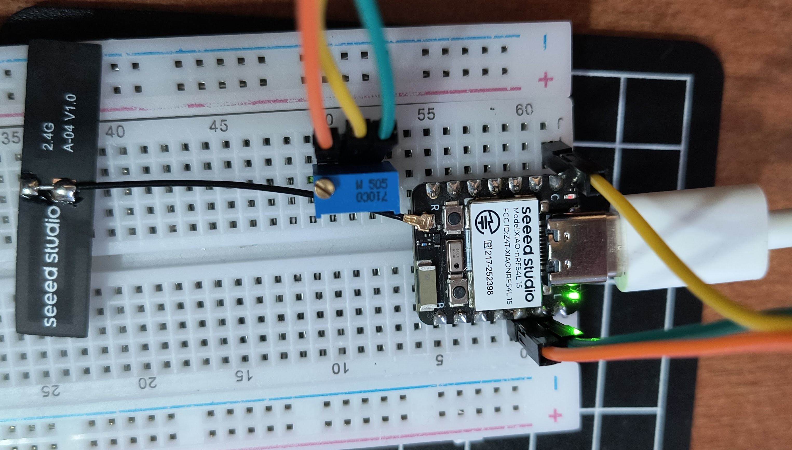

# ADC Variable Blink Sample

This sample demonstrates how to read analog values from a potentiometer using ADC and control LED blink timing on the Seeed XIAO nRF54L15.

## Features

- ADC reading from potentiometer (A0 pin)
- Variable LED blink rate based on analog input
- Voltage conversion and logging
- Support for all 4 accessible analog pins (A0-A3)

## Hardware Requirements

- Seeed XIAO nRF54L15 development board
- Potentiometer (10kΩ recommended)
- Breadboard and jumper wires
- USB-C cable for power and programming

### Wiring

Connect the potentiometer as follows:

| Potentiometer Pin | Connection |
|-------------------|------------|
| Left pin          | GND        |
| Center pin (wiper)| A0 (P1.04) |
| Right pin         | 3.3V       |

The built-in LED (led0 on P2.0) will blink at a rate controlled by the potentiometer position.

### Breadboard Wiring Example



## How It Works

The sample continuously reads the analog input and uses an inverted mapping for intuitive control:
- **3300mV** (pot at maximum): LED blinks fast (0ms delay = continuous toggling)
- **0mV** (pot at minimum): LED blinks slowly (3300ms = 3.3 second delay)
- The mapping is inverted: higher voltage = faster blink, lower voltage = slower blink

This creates an intuitive control where turning the potentiometer up (increasing voltage) makes the LED blink faster.

## Pin Mapping

The XIAO nRF54L15 has 4 accessible analog pins on the header:

| Header Pin | GPIO   | ADC Channel | Array Index |
|------------|--------|-------------|-------------|
| A0         | P1.04  | AIN0        | 0           |
| A1         | P1.05  | AIN1        | 1           |
| A2         | P1.06  | AIN2        | 2           |
| A3         | P1.07  | AIN3        | 3           |

**Note**: These are the only accessible analog pins on the XIAO header. This sample uses A0 by default for the potentiometer input.

## Building and Running

This sample is built using the Nordic Connect SDK (NCS). To build:

```bash
west build -b xiao_nrf54l15/nrf54l15/cpuapp
west flash
```

## Expected Output

The sample will continuously read the potentiometer value and adjust the LED blink rate accordingly. Higher voltage = faster blink (inverted mapping). Console output will show:

```
Starting ADC Blink Example...
ADC device ready for potentiometer
LED ready on pin P2.0
ADC Raw = 512 (660 mV)     Blink Delay = 2670 ms
ADC Raw = 2048 (2640 mV)   Blink Delay = 660 ms
ADC Raw = 3789 (3330 mV)   Blink Delay = 0 ms
```

As you turn the potentiometer:
- **Left (0V)**: LED blinks slowly at ~3.3 second intervals
- **Middle (~1.65V)**: LED blinks at ~1.65 second intervals
- **Right (3.3V)**: LED toggles continuously (very fast blinking)

## Configuration

### Changing the ADC Input Pin

To use a different analog pin (A1, A2, or A3), modify the `POTENTIOMETER_ADC_CHANNEL_IDX` in `src/main.c`:

```c
#define POTENTIOMETER_ADC_CHANNEL_IDX 0  // For A0 (P1.04) - default
#define POTENTIOMETER_ADC_CHANNEL_IDX 1  // For A1 (P1.05)
#define POTENTIOMETER_ADC_CHANNEL_IDX 2  // For A2 (P1.06)
#define POTENTIOMETER_ADC_CHANNEL_IDX 3  // For A3 (P1.07)
```

### Adjusting Blink Timing Range

The current implementation uses a 1:1 mapping of millivolts to milliseconds. To change the blink speed range, modify these defines in `src/main.c`:

```c
#define MIN_BLINK_MS 0     // Minimum delay (at 0mV)
#define MAX_BLINK_MS 3300  // Maximum delay (at 3300mV)
```

For example, to limit the range to 100-1000ms regardless of voltage:
```c
#define MIN_BLINK_MS 100   // Never blink faster than 100ms
#define MAX_BLINK_MS 1000  // Never blink slower than 1000ms
```

### Device Tree Configuration

The device tree overlay (`boards/xiao_nrf54l15_nrf54l15_cpuapp.overlay`) configures all 4 available ADC channels. The built-in LED (led0) on P2.0 is controlled via GPIO toggle.