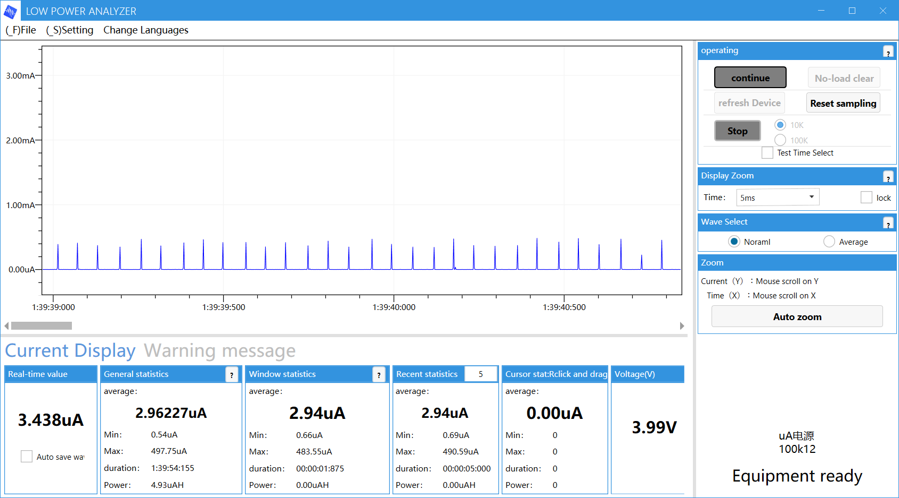

# Low Power System Off Sample

This sample demonstrates the system off power management feature on the Seeed XIAO nRF54L15. The sample shows how to enter the lowest power mode and wake up using a button press.

## Features
- System OFF mode (lowest power consumption)
- Wake-up from button press (SW0)
- Reset cause detection and reporting
- Console power management
- IMU power rail control

## Hardware Requirements
- Seeed XIAO nRF54L15 development board
- Button SW0 (built-in)
- USB connection for programming and monitoring

## Power Consumption
- **System OFF**: < 1 μA (ultra-low power)
- **Normal Operation**: Several mA
- **Wake-up**: Instant wake-up on button press



## Building and Running

```bash
west build -b xiao_nrf54l15/nrf54l15/cpuapp
west flash
```

## Expected Output

### Initial Boot:
```
xiao_nrf54l15/nrf54l15/cpuapp system off demo
Reset by debugger.
Entering system off; press sw0 to restart
```

### After Wake-up:
```
xiao_nrf54l15/nrf54l15/cpuapp system off demo
Wakeup from System OFF by GRTC.
Entering system off; press sw0 to restart
```

## Operation Sequence
1. **Power On**: Device boots and shows initial message
2. **Configuration**: Button SW0 is configured as wake-up source
3. **Console Suspend**: UART console is suspended to save power
4. **System OFF**: Device enters ultra-low power mode
5. **Wake-up**: Press SW0 to wake up the device
6. **Repeat**: Cycle continues indefinitely

## Technical Details
- **Wake-up Source**: GPIO interrupt on SW0 (level low)
- **Reset Cause**: Detected using hardware info driver
- **Power Management**: Console device suspended before system off
- **IMU Power**: Power rail disabled by device tree override

## Power Optimization Features
- IMU power rail disabled (`regulator-boot-on` removed)
- Console suspended before system off
- All unnecessary peripherals powered down
- GPIO configured for minimal power consumption

## Reset Causes
The sample can detect different reset/wake-up causes:
- **RESET_DEBUG**: Debugger or initial programming
- **RESET_CLOCK**: Wake-up from system OFF (GRTC wake-up)
- **Other**: Various other wake-up sources

## Device Tree Configuration
The overlay file disables the IMU power rail boot-on property:
```dts
&pdm_imu_pwr{
    /delete-property/ regulator-boot-on;
};
```

## Button Configuration
- **Pin**: SW0 (built-in button)
- **Mode**: GPIO input with interrupt
- **Trigger**: Level low (active when pressed)
- **Wake-up**: Configured as system wake-up source

## Troubleshooting
- **No wake-up**: Ensure SW0 button is pressed firmly
- **High power consumption**: Check for active peripherals or incorrect configuration
- **Console not working**: Normal after system off - reprogram to restart
- **Reset cause unknown**: Check for external reset sources

## Use Cases
- Battery-powered applications
- Long-term monitoring devices
- Event-triggered systems
- Ultra-low power sensor nodes
- Emergency wake-up systems