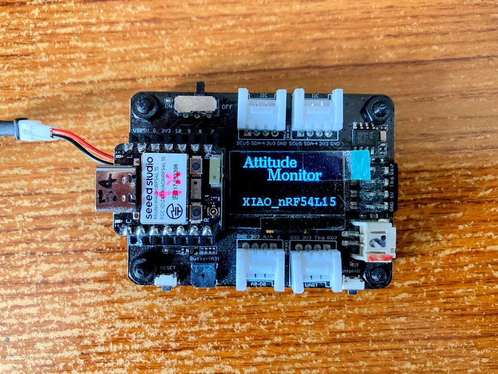
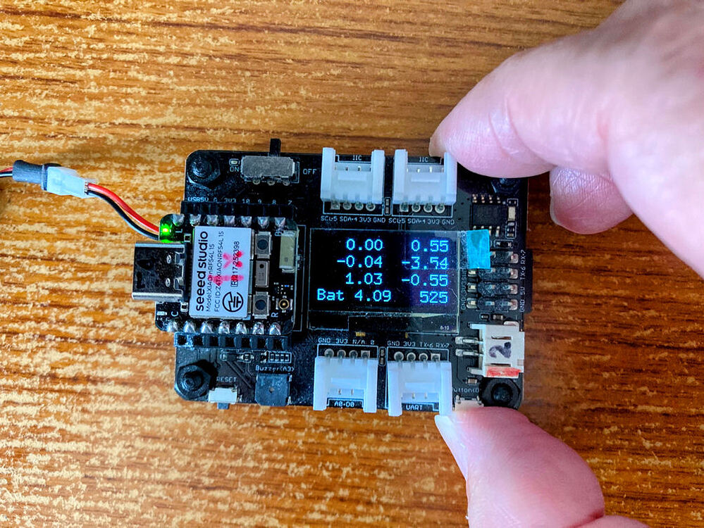
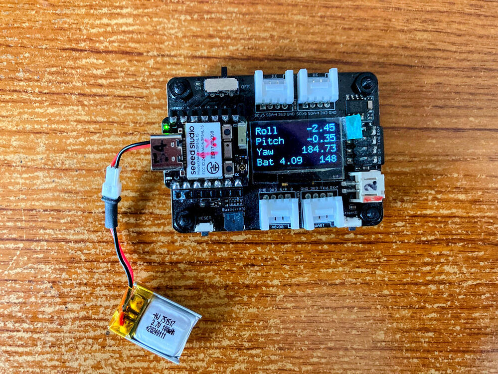

# Attitude Monitor for XIAO nRF54L15

An attitude monitoring system built for the XIAO nRF54L15 Sense with expansion base, featuring real-time IMU data processing, attitude calculation using the Madgwick filter, and OLED display output.

## Features

- **Real-time Attitude Monitoring**: Uses IMU data (accelerometer and gyroscope) to calculate pitch, roll, and yaw
- **Madgwick Filter**: Advanced sensor fusion algorithm for accurate attitude estimation
- **OLED Display**: Clear visualization on SSD1306 128x64 display
- **Battery Monitoring**: Real-time battery voltage display
- **Interactive Interface**: Toggle between attitude data and raw accelerometer/gyro readings with user button
- **Multiple Display Modes**: 
  - Title screen with custom fonts
  - Battery voltage monitoring
  - Live attitude data (pitch, roll, yaw)
  - Raw IMU data display

## Hardware Requirements

- **XIAO nRF54L15 Sense** - Main microcontroller with built-in IMU
- **XIAO Expansion Base** - Provides OLED display, user button, and battery monitoring
- **SSD1306 OLED Display** (128x64) - Integrated in expansion base

## Screenshots

### Title Screen

*Application startup screen showing the attitude monitor title with stylized fonts*

### Battery Voltage Display

*Real-time battery voltage monitoring display*

### Attitude Data Output

*Live IMU attitude data showing pitch, roll, and yaw values*

## Usage

1. **Power On**: The device starts with the title screen
2. **Navigate**: Press the user button on the expansion base to toggle between display modes:
   - Attitude data (pitch, roll, yaw)
   - Raw accelerometer and gyroscope data
   - Battery voltage display
3. **Monitor**: View real-time sensor data and calculated attitude values

## Development Environment

- **IDE**: Visual Studio Code 1.104.2
- **SDK**: nRF Connect SDK v3.1.1
- **Toolchain**: Nordic nRF Connect SDK toolchain

## Dependencies

This project uses centralized libraries managed as git submodules:

- **U8g2 Graphics Library**: For OLED display control and various font support
  - Location: `../../../lib/u8g2/` (centralized submodule)
  - Repository: [GitHub - olikraus/u8g2](https://github.com/olikraus/u8g2)
- **Arduino MadgwickAHRS**: For sensor fusion and attitude calculation
  - Location: `../../../lib/MadgwickAHRS/` (centralized submodule)  
  - Repository: [GitHub - arduino-libraries/MadgwickAHRS](https://github.com/arduino-libraries/MadgwickAHRS)
- **Zephyr RTOS**: Base real-time operating system
- **Nordic nRF Connect SDK**: Hardware abstraction and drivers

## Setup Instructions

1. **Install Development Environment**:
   - Install nRF Connect SDK v3.1.1
   - Install Visual Studio Code with nRF Connect extension
   - Set up the toolchain in your preferred directory

2. **Initialize Git Submodules**:
   ```bash
   # From repository root (M:\projects\nRF54L15\)
   git submodule update --init --recursive
   ```

3. **Build and Flash**:
   - Open the project in VS Code
   - Build using nRF Connect SDK
   - Flash to your XIAO nRF54L15 device

## Project Structure

```
Repository Structure:
nRF54L15/
├── lib/                           # Centralized libraries (git submodules)
│   ├── u8g2/                     # U8g2 display library
│   │   └── csrc/                 # U8g2 source files
│   └── MadgwickAHRS/             # Arduino Madgwick AHRS library
│       └── src/                  # Madgwick source files
└── zephyr-expansion-base-for-xiao/
    └── attitude_monitor-ncs/      # This sample
        ├── src/                   # Source code files
        ├── boards/                # Board-specific configurations
        ├── CMakeLists.txt         # Build config (references centralized libs)
        ├── prj.conf               # Project configuration
        └── Release_binary/        # Compiled binaries
```

## Technical Details

- **Sensor Fusion**: Implements Madgwick filter algorithm for combining accelerometer and gyroscope data
- **Display Driver**: Uses U8g2 library for efficient OLED control with multiple font support
- **Real-time Processing**: Continuous IMU data acquisition and processing
- **Power Management**: Battery voltage monitoring and display

## Acknowledgments

**Special thanks to MSfujino from the Seeed Studio forums for creating this excellent example project.** This implementation demonstrates practical use of the XIAO nRF54L15 Sense with the expansion base, providing a solid foundation for IMU-based applications.

Original forum discussion and project creation by MSfujino - thank you for sharing this valuable example with the community!

## License

This project builds upon work from the Seeed Studio community and uses open-source libraries. Please respect the individual licenses of the components used.

## Contributing

Feel free to submit issues, fork the repository, and create pull requests for any improvements.

---

*This project serves as a practical reference for anyone interested in developing IMU-based applications with the XIAO nRF54L15 platform.*
