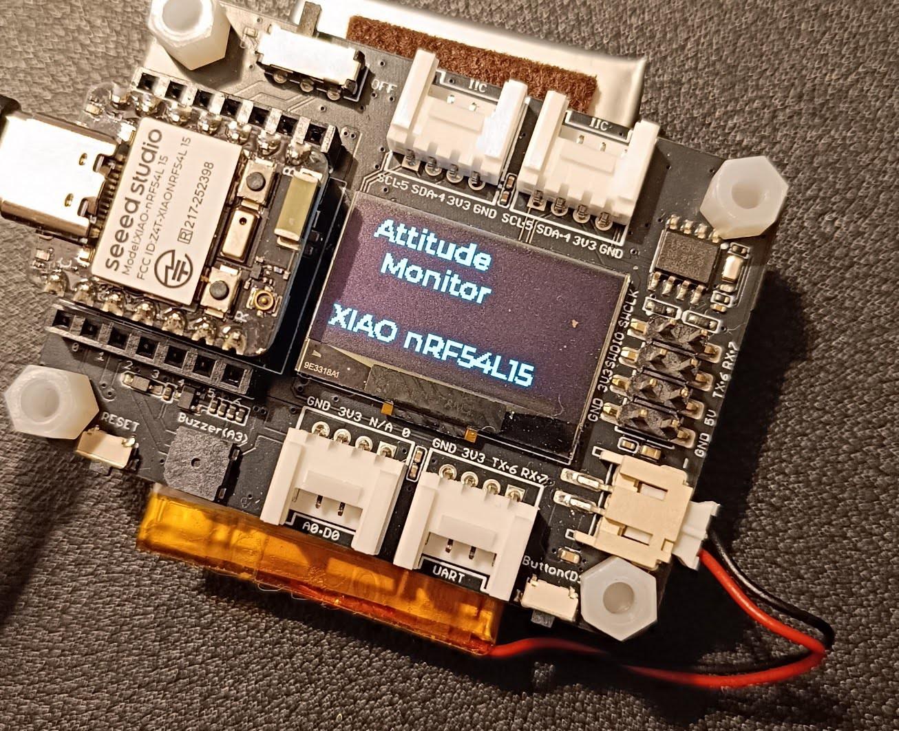
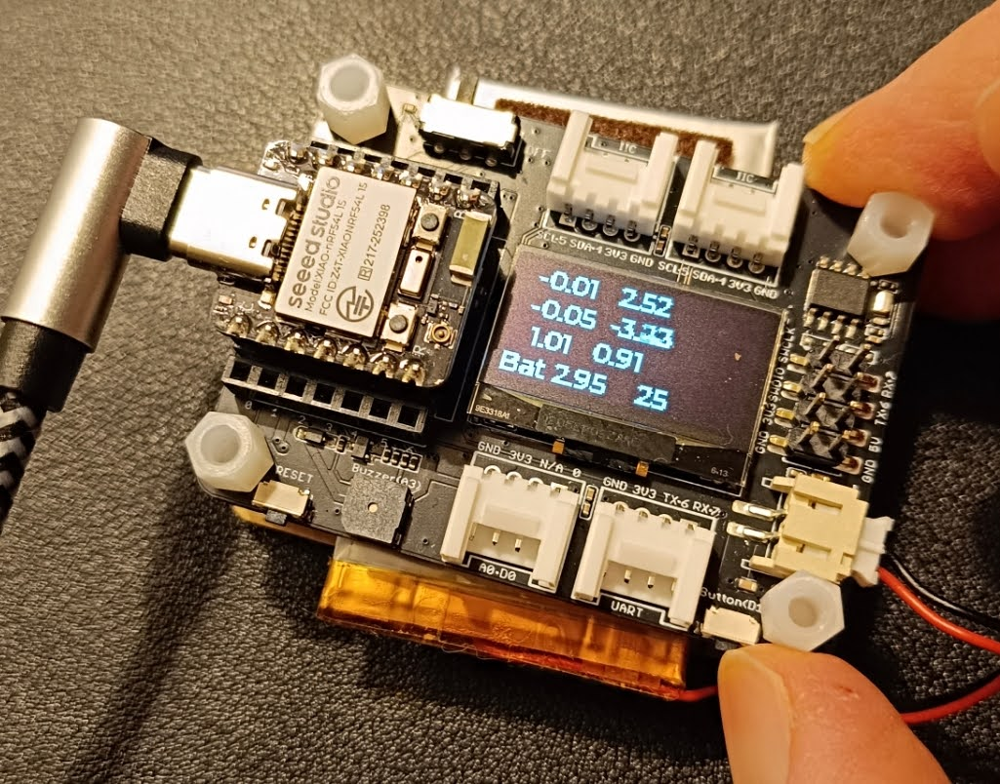
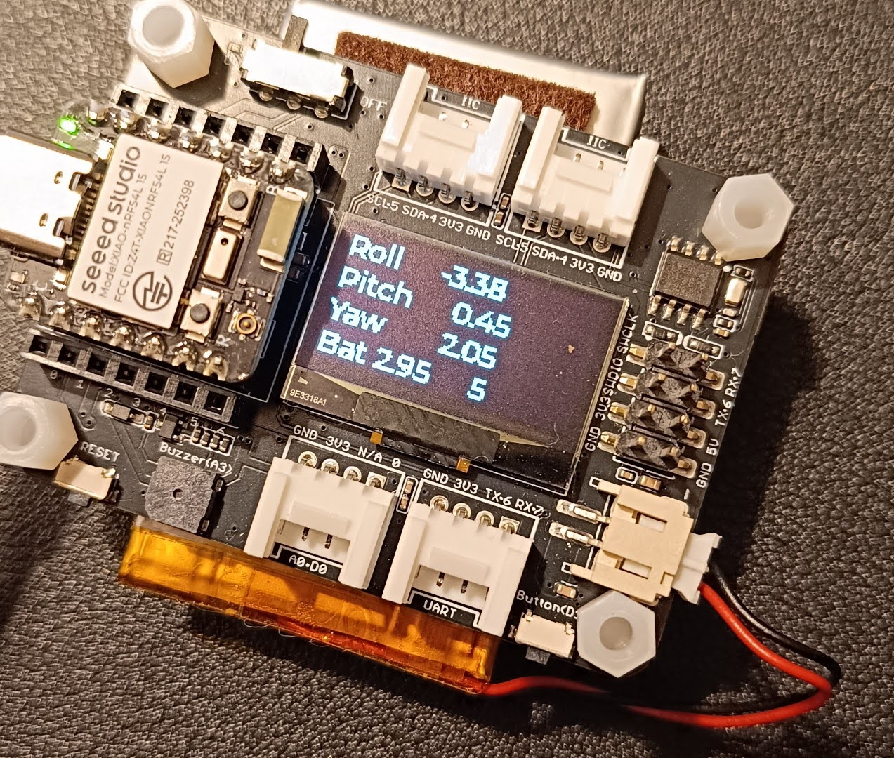

# Attitude Monitor for XIAO nRF54L15

An attitude monitoring system built for the XIAO nRF54L15 Sense with expansion base, featuring real-time IMU data processing, attitude calculation using the Madgwick filter, and OLED display output.

## Status

✅ **Tested and Working** - Successfully built and flashed with zephyr-sdk-0.17.2 (November 2025)

## Features

- **Real-time Attitude Monitoring**: Uses IMU data (accelerometer and gyroscope) to calculate pitch, roll, and yaw
- **Madgwick Filter**: Advanced sensor fusion algorithm for accurate attitude estimation
- **OLED Display**: Clear visualization on SSD1306 128x64 display using LVGL graphics library
- **Battery Monitoring**: Real-time battery voltage display
- **Interactive Interface**: Toggle between attitude data and raw accelerometer/gyro readings with user button
- **Multiple Display Modes**:
  - Title screen with LVGL labels
  - Battery voltage monitoring
  - Live attitude data (pitch, roll, yaw)
  - Raw IMU data display

## Hardware Requirements

- **XIAO nRF54L15 Sense** - Main microcontroller with built-in IMU
- **XIAO Expansion Base** - Provides OLED display, user button, and battery monitoring
- **SSD1306 OLED Display** (128x64) - Integrated in expansion base

## Screenshots

### Title Screen


*Application startup screen showing the attitude monitor title with stylized fonts*

### Battery Voltage Display


*Real-time battery voltage monitoring display (now incorrect value cause battery attached to expansion JST)*

### Attitude Data Output


*Live IMU attitude data showing pitch, roll, and yaw values*

## Usage

1. **Power On**: The device starts with the title screen
2. **Navigate**: Press the user button on the expansion base to toggle between display modes:
   - Attitude data (pitch, roll, yaw)
   - Raw accelerometer and gyroscope data
   - Battery voltage display
3. **Monitor**: View real-time sensor data and calculated attitude values

## Development Environment

- **IDE**: Visual Studio Code 1.105.1
- **SDK**: zephyr-sdk-0.17.2
- **RTOS**: Zephyr 4.2.99

## Dependencies

All dependencies are native to Zephyr - no external libraries or git submodules required compared to original version:

- **LVGL Graphics Library**: Modern embedded graphics library for OLED display control
  - Integrated with Zephyr RTOS
  - Provides advanced UI capabilities and efficient rendering
- **CMSIS-DSP**: ARM's Cortex Microcontroller Software Interface Standard for DSP
  - Used for quaternion math and sensor fusion
  - Native Madgwick filter implementation using CMSIS-DSP quaternion functions
  - Optimized ARM math library
- **Zephyr Sensor API**: Hardware abstraction and drivers for fetching IMU sensor data

## Setup Instructions

1. **Install Development Environment**:
   - Install Zephyr SDK on your OS
   - Install Visual Studio Code
   - Add udev rules for Linux to access your board over USB
   

2. **Build and Flash**:
  
   - Build and flash using provided code workspace: Ctrl+Shift+P >> Tasks/Run Task
  Current configuration assumes your project repo 5 subfolders inside `/zephyrproject`, for example `/home/USER/zephyrproject/zephyr/samples/myrosprojects/xiao_trials/attitude_monitor`

## Project Structure

```
Repository Structure:
zephyrproject/
└── zephyr/
    └── samples/
        └── rosprojects/
            └── toastee0/
                └── attitude_monitor/      # This sample
                    ├── src/               # Source code files
                    │   ├── main.cpp       # Main application with LVGL
                    │   └── madgwick_cmsis.h  # CMSIS-DSP Madgwick filter
                    ├── boards/            # Board-specific configurations
                    │   ├── *.overlay      # Device tree overlay (display config)
                    │   └── *.conf         # Board-specific config
                    ├── CMakeLists.txt     # Build configuration
                    ├── prj.conf           # Project configuration (LVGL + CMSIS-DSP)
```

## Technical Details

- **Sensor Fusion**: Custom Madgwick filter implementation using CMSIS-DSP
  - Quaternion-based orientation tracking
  - Combines accelerometer and gyroscope data (6-DOF IMU)
  - Uses ARM CMSIS-DSP `arm_quaternion_normalize_f32()` for efficient quaternion normalization
  - No external dependencies - pure Zephyr/CMSIS-DSP implementation
- **Graphics Library**: Uses LVGL (Light and Versatile Graphics Library) for modern, efficient UI rendering
  - Monochrome display support (1-bit color depth)
  - Label widgets for text display
  - Efficient frame buffer management
  - Integrated with Zephyr's display driver subsystem
  - **Disadvantage of LVGL**: it is not so memory efficient like U8g2, ~4 times more memory needed
- **Display Driver**: Zephyr's native SSD1306 driver with LVGL integration
- **Real-time Processing**: Continuous IMU data acquisition and processing at 12.5 Hz
- **Power Management**: Battery voltage monitoring and display


## Acknowledgments

**Special thanks to MSfujino from the Seeed Studio forums for creating this excellent example project.** This implementation demonstrates practical use of the XIAO nRF54L15 Sense with the expansion base, providing a solid foundation for IMU-based applications.

Original forum discussion and project creation by MSfujino - thank you for sharing this valuable example with the community!

## License

This project builds upon work from the Seeed Studio community and uses open-source libraries. Please respect the individual licenses of the components used.

## Contributing

Feel free to submit issues, fork the repository, and create pull requests for any improvements.

---

*This project serves as a practical reference for anyone interested in developing IMU-based applications with the XIAO nRF54L15 platform.*
